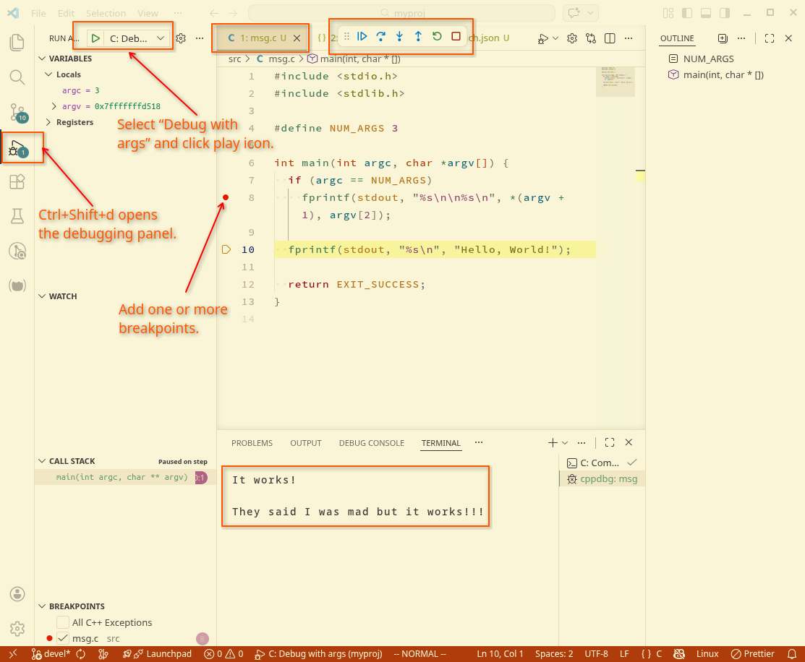

---
tags:
  - c
  - debug
  - gdb
  - vscode
description: Example configuration and steps to debug a C program with STDIN args on VS Code
---
## Project structure

```text
$ mkdir -pv myproj/{.vscode,src}
mkdir: created directory './myproj'
mkdir: created directory './myproj/.vscode'
mkdir: created directory './myproj/src'

$ cd myproj

$ touch .vscode/{task,launch}.json

$ tree -aC ./
.
├── src
│   ├── msg
│   └── msg.c
└── .vscode
    ├── launch.json
    └── tasks.json

$ code .
```


## Sample C program with STDIN args

```c
#include <stdio.h>
#include <stdlib.h>

#define NUM_ARGS 3

int main(int argc, char *argv[]) {
  if (argc == NUM_ARGS)
    fprintf(stdout, "%s\n\n%s\n", *(argv + 1), argv[2]);

  fprintf(stdout, "%s\n", "Hello, World!");

  return EXIT_SUCCESS;
}
```


## VS Code debug configs

### .vscode/tasks.json

A “task” to build the current C file. Note `-g` to compile with debug symbols.

```json
{
  "version": "2.0.0",
  "tasks": [
    {
      "type": "cppbuild",
      "label": "C: Compile active C file",
      "command": "/usr/bin/gcc",
      "args": [
        "-std=c99",
        "-fdiagnostics-color=always",
        "-g",
        "-pedantic",
        "-Wall",
        "${file}",
        "-o",
        "${fileDirname}/${fileBasenameNoExtension}"
      ],
      "options": {
        "cwd": "${fileDirname}"
      },
      "problemMatcher": ["$gcc"],
      "group": {
        "kind": "build",
        "isDefault": false
      }
    }
  ]
}
```


### .vscode/launch.json

A piece of config to allow us to run the current built file in debug mode, while passing STDIN arguments. Note that, among other things, it uses the task we created previously in the `preLaunchTask` property.

```json
{
  "configurations": [
    {
      "name": "C: Debug with args",
      "type": "cppdbg",
      "request": "launch",
      "program": "${fileDirname}/${fileBasenameNoExtension}",
      "args": ["It works!", "They said I was mad but it works!!!"],
      "stopAtEntry": false,
      "cwd": "${fileDirname}",
      "environment": [],
      "externalConsole": false,
      "MIMode": "gdb",
      "setupCommands": [
        {
          "description": "Enable pretty-printing for gdb",
          "text": "-enable-pretty-printing",
          "ignoreFailures": true
        }
      ],
      "preLaunchTask": "C: Compile active C file",
      "miDebuggerPath": "/usr/bin/gdb"
    }
  ]
}
```

## Start the debugger

In VS Code, make sure the `msg.c` file is the active one, then press `Ctrl+Shift+d` to open the debug panel. From there, select “C: Debug with args” and click the triangle to start the process. A terminal and a few other UI things should show up, like in the screenshot below.



## References

- https://code.visualstudio.com/docs/debugtest/debugging-configuration
- https://code.visualstudio.com/docs/debugtest/tasks
