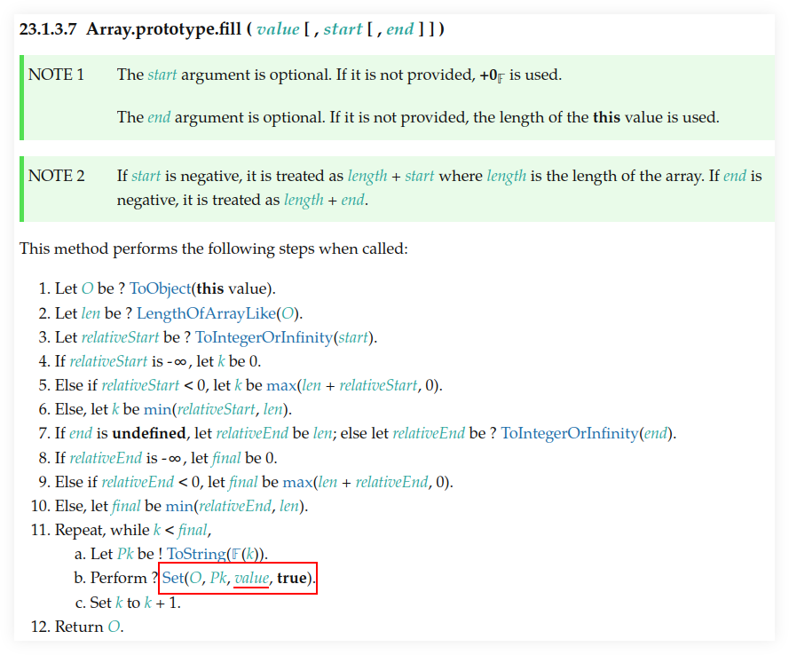

---
tags:
  - dsa
  - array
title:
---
## Intro

An array is a contiguous memory space.

4 bytes = 32 bit number. 8 bytes = 64 bit number.

```
arr = int[3]
```

## Intro

An array is a contiguous memory space.

A 32-bit is 4 bytes * 8 = 32.

A 64-bit is 8 bytes * 8 = 64.

`a[0]` is 0 to 31 bits. Bit 34 to 63 is `a[1]`.

4 bytes, 32 bit number.

Node REPL session:
```
> var a = new ArrayBuffer(6)

> a
ArrayBuffer { [Uint8Contents]: <00 00 00 00 00 00>, byteLength: 6 }
> var a8 = new Uint8Array(a)

> a8[0] = 0xff
255

> a8
Uint8Array(6) [ 255, 0, 0, 0, 0, 0 ]
```

With arrays, _insert_ means _overwrite_, or “update the value at the given index”. An array index is replaced with whatever previous value was there (`\0`, `NUL`). It doesn’t “grow” the array.

```
arr + width_of_the_type + offset
```

_Delete_ means “replace with `\0` (or `NUL`). It doesn’t _shrink_ the array. `NUL` means “NOT something” in this “very real spot”.

## Big O of array operations

- GET: $O(1)$.
- SET: $O(1)$.
- DELETE: $O(1)$.

It is basically the `type_width * offset`. Constant time.

Constant time doesn’t mean “we do one operation”. It means, “we do a constant amount of things despite the size of input.”

## Array of n elements

```javascript
Array(5).fill(0);
```

The above makes a sparse array, and sparse arrays are permanently slow.

Using `Array()` has always been considered a bad practice and engines never bothered to optimizing it as they would have to check the prototype chain.

This is the more recommended way of creating an array of $n$ elements:

```javascript
Array.from({ length: 5 }) => (_, i) => i;
```

## Return array with conditional item

Suppose we want to return an array like this:

```js
function getScripts() {
  return [
    "one.js",
    "two.js",
    "three.js",
  ];
}
```

But imagine based on some flag we want to skip "one.js" and return only the other two scripts. One approach is using some spread trickery:

```javascript
function getScripts(b) {
  return [
    ...(b ? ["one.js"] : []),
    "two.js",
    "three.js",
  ];
}

getScripts(0);
//=> ["two.js", "three.js"]

getScripts(1);
//=> ["one.js", "two.js", "three.js"]
```

But the iterator protocol is slower than some alternatives. Doing the spread is idiomatic enough, but if performance becomes a problem, using `[].concat()` is an alternative (and we want to avoid mutations like when using `unshift()` `push()`).

```javascript
function getScripts(b) {
  return [].concat(
    b
      ? ["one.js"]
      : [], "two.js", "three.jsx"
  );
}

getScripts(0);
//=> ["two.js", "three.js"]

getScripts(1);
//=> ["one.js", "two.js", "three.js"]
```

## Swap array element

Wee need to swap (in place) element and index 0 to element at index 3.
Good old approach which work on most languages which allow mutable data structures:

**stood the test of time**

```javascript
var xs = [10, 20, 30, 40];
var tmp = xs[0];
xs[0] = xs[3];
xs[3] = tmp;
log(xs);
//=> [ 40, 20, 30, 10 ]
```

Not all languages allow something like this:

**smart approach**

```javascript
var xs = [10, 20, 30, 40];

[xs[0], xs[3]] = [xs[3], xs[0]];
log(xs);
//=> [ 40, 20, 30, 10 ]
```

**ES6 example:**

```
$ deno repl (or node --interactive):

> var chars = ['a', 'c', 'b'];

> [chars[1], chars[2] = chars[2], chars[1]]
[ "c", "b", "c" ]

> chars
[ "a", "c", "b" ]
```

```javascript
function swap(
  xs: number[],
  idx1: number,
  idx2: number,
): void {
  [xs[idx1], xs[idx2]] = [xs[idx2], xs[idx1]];
}
```

* [Javascript swap array elements (StackOverflow)](https://stackoverflow.com/questions/872310/javascript-swap-array-elements#comment131093228_872317)

## Array.prototype.fill() problem‽

**node repl session example**

```text
$ node --interactive

> var buckets = Array(10).fill([]);

> buckets
[
  [], [], [], [], [],
  [], [], [], [], []
]

> buckets[5].push(35);
1
> buckets
[
  [ 35 ], [ 35 ],
  [ 35 ], [ 35 ],
  [ 35 ], [ 35 ],
  [ 35 ], [ 35 ],
  [ 35 ], [ 35 ]
]
```

Want to push 35 to the 5th bucket, but all of the buckets get filled 😭.

The problem seems to be `Array(10).fill()`, because this works:

```text
> var buckets = [[], [], [], [], [], [], [], [], [], []];

> buckets.length
10
> buckets[5].push(35);
1
> buckets
[
  [], [], [],
  [], [], [ 35 ],
  [], [], [],
  []
]
```

Note only sub-array at index 5 got pushed the value 35.

See [the spec](https://tc39.es/ecma262/multipage/indexed-collections.html#sec-array.prototype.fill) and [MDN docs](https://developer.mozilla.org/en-US/docs/Web/JavaScript/Reference/Global_Objects/Array/fill).




> changes all elements in an array to a **static** value [...]
> -- MDN Docs on Array.prototype.fill()

It all means when we fill with `[]` (which is a reference type and not a primitive), all positions are filled with the same object in memory, and not 10 different empty arrays.
It is the same array in memory, used 10 times.

### Clever approach

OK, we can manually do this:

```
[[], [], [], [], [] (many more []s here...)]
```

But what if we need 100 or 500 (ore more) sub-arrays?

```
$ deno repl
Deno 1.28.2

> var xs = Array.from({ length: 1e5 }, () => []);

> xs.length
100000

> Array.from({ length: 10 }, () => []);
[
  [], [], [], [], [],
  [], [], [], [], []
]
```

This works because the anonymous arrow function is invoked each for each one of the $1 \times 10 ^ 5$ (100_000) elements we want to create so we end up with 100000 different empty array references in memory.

And note it creates an array containing `length` arrays.

<dl><dt><strong>💡 TIP</strong></dt><dd>

Did you know we can write 100_000_000 instead of 100000000 in ECMAScript to make large numbers more readable‽
</dd></dl>

## Concatenate (flatten) arrays

First, let’s see the basics of how `Array.prototype.concat()` works:

**deno repl simple concat()**

```
$ deno repl

> var a1 = [10, 20];
> var a2 = [30, 40];

> var all = a1.concat(a2);

> all
[ 10, 20, 30, 40 ]
```

Note the result is **not** something like:

```
[[10, 20], [30, 40]]
```

No, it is instead a flat result of the `a1` and `a2`.
Of course, both `a1` and `a2` are flat themselves, so, concat’ing them produces a flat result.

**deno repl flatten (NOK)**

```
> var xs = [[10, 20], [30, 40], [50, 60]];

> var flat = [].concat(xs);

> flat
[ [ 10, 20 ], [ 30, 40 ], [ 50, 60 ] ]
```

We still got an array with nested arrays instead of a flattened array with all elements of the original sub-arrays...

One solution:

**deno repl flatten loop (OK)**

```
var xs = [[10, 20], [30, 40], [50, 60]];

> var flat = [];
> for (var i = 0; i < xs.length; ++i)
    flat = flat.concat(xs[i]);

> flat
[ 10, 20, 30, 40, 50, 60 ]
```

But note how we have to reassign `flat` (`concat()` does not modify the receiver).

Another solution is this:

**deno repl flatten spread (OK)**

```
> var xs = [[10, 20], [30, 40], [50, 60]];

> var flat = [].concat(...xs);

> flat
[ 10, 20, 30, 40, 50, 60 ]
```

This works because `...xs` will expand to each individual sub-array, which are each concat’ed correctly and we end up with a flattened array.

## Generate an array of random numbers

### JavaScript

#### apply and map approach
```javascript
Array.apply(null, { length: 1e5 })
  .map(Function.call, Math.random);
```

On the repl:

```
$ deno repl

> Array.apply(null, { length: 4 })
  .map(Function.call, Math.random);
[
  0.013555371023429963,
  0.4090884169905944,
  0.05656425921292585,
  0.29989721347892306
]
```

### Array.from approach

**Node.js REPL**

```javascript
> Array.from({ length: 4 }, Math.random);
//=> [
//=>   0.8160035401943684,
//=>   0.7165590142911911,
//=>   0.5482091809438912,
//=>   0.7045703602373274
//=> ]
```

We can create some helper functions.

**librand.js**

```javascript
var random = Math.random.bind(Math);

/**
 * Generates a random integer between `min` (inclusive)
 * and `max` (exclusive).
 *
 * A `rand(1, 5)` may return 1, 2, 3 or 4 but never 5.
 *
 * @sig Number Number -> Number
 */
function rand(min, max) {
  // Replace (max - min) with (max + 1 - min) to cause max
  // to be inclusive as well.
  return (random() * (max - min) | 0) + min;
}

// var i = 0;
// while (i++ < 1e1) log(rand(1, 5));

/**
 * Generates an array of `len` random integers between
 * `min` (inclusive) and `max` (exclusive).
 *
 * @sig Number -> [Number]
 */
function randIntArr(len, min = 1, max = 100) {
  return Array.apply(null, { length: len })
    .map(Function.call, () => rand(min, max));
}

export {
  random,
  rand,
  randIntArr,
};
```

And then we can try it:

**node repl random ints**

```
$ node --interactive
var mod = await import('./librand.js');

var { rand, randIntArr } = mod;

> rand(-5, 0);
-3
> rand(10, 15);
11
> rand(10, 15);
13

> randIntArr(12, 5, 10);
[
  8, 7, 6, 6, 5,
  7, 9, 9, 5, 6,
  7, 6
]

> randIntArr(25, -10, 10);
[
   0, -5,  1,  5, 0, -7, -5,  8,
   2,  9, -9, -6, 7,  3, -5, -3,
  -8,  9,  2, -3, 7, -4, -8,  4,
  -9
]
```

## Linear search number in array
2025-06-25 16:54

### TypeScript
#### Unit tests

```typescript
import { search } from "./search";

describe("search()", () => {
  it("should find nothing if input is empty", () => {
    expect(search(1, [])).toBe(false);
  });

  it("should find if anywhere in the array", () => {
    expect(search(1, [1])).toBe(true);
    expect(search(1, [-5, 1, 3])).toBe(true);
    expect(search(1, [-5, 3, 1])).toBe(true);
  });
});
```

#### Solution

```typescript
const log = console.log.bind(console);

export function search(
  needle: number,
  haystack: Array<number>,
): boolean {
  for (const num of haystack) {
    if (num === needle) return true;
  }

  return false;
}

if (require.main === module) {
  log(search(7, []));
  log(search(7, [3, 5, 9, 7, 1]));
  log(search(7, [1, 9, 1001]));
}
```