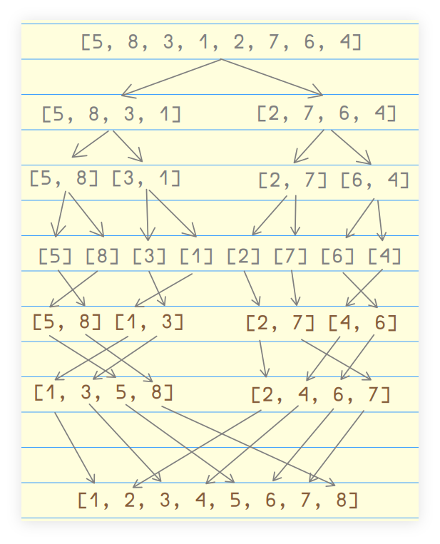
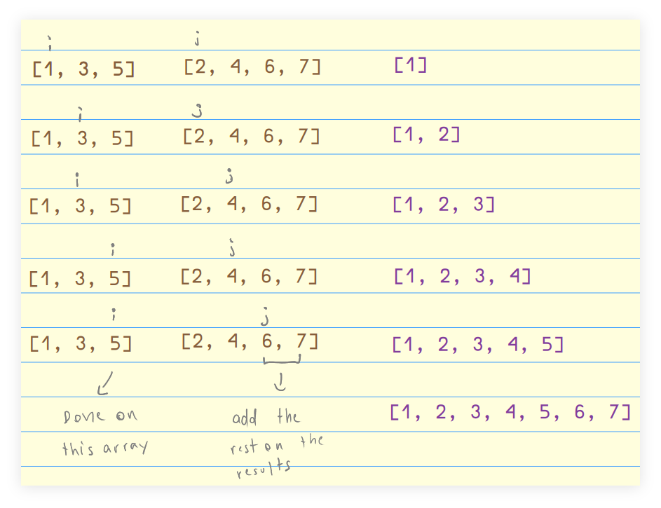

---
tags:
  - sort
  - merge-sort
  - dsa
description: Notes, tips and examples on implementing the merge sort algorithm.
---


## Intro

Merge sort involves these ideas:

- Split the input array into smaller arrays of 0 or 1 element
- Progressively merge the arrays back, in sorted manner.
- Rely on the fact that arrays of 0 or 1 element is always sorted by definition.



When merging back, we merge in a sorted fashion! That is where the name “merge sort” comes from.

## Merge Sorted Arrays Function

Given two sorted arrays, implement a function that returns a new, also sorted array with all the elements of the two input arrays. Both input arrays are sorted “in the same direction”.

Both time and space complexity should be $O(n + m)$. ($n + m$) because there are two input arrays and we iterate over each element in each array once) and the original inputs should not be changed; that is, treat them as immutable data.

- Loop while there are values not looked up yet.
- If the value in the first array is less than the value in the second array, add the value in the first array into the results array and move on to the next value of the first array.
- If the value in the of the second array is less than the value in the first array, add the value in the second array into the results array and move on to the next value in the second array.
- Once one array is exhausted, push the remaining values on the other array to the results array.


We have to handle the case when they are the same value to. Some approaches:

```
if (xs[i] >= ys[j]) ... else ...

if (ys[j] <= xs[i] ... else ...
```

For example:

```
while (i < xsLen && j < ysLen) {
  if (xs[i] <= ys[j]) res.push(xs[i++]);
  else res.push(ys[j++]);
}
```

Note the `<=`. But just using `<` only works too, as then the “equals to” will automatically be handled by the else clause:

```
while (i < xsLen && j < ysLen) {
  if (xs[i] < ys[j]) res.push(xs[i++]);
  else res.push(ys[j++]);
}
```

Just pick one to include “the equal case”.

### merge() helper

```javascript
/**
 * A helper function that merges two already sorted (and in the same
 * direction) arrays in an also sorted resulting array.
 *
 * @sig [Number] [Number] -> [Number]
 */
function merge(xs, ys) {
  var i = 0;
  var j = 0;
  var xsLen = xs.length;
  var ysLen = ys.length;
  var res = [];

  while (i < xsLen && j < ysLen) {
    if (xs[i] < ys[j])
      res.push(xs[i++]);
    else
      res.push(ys[j++]);
  }

  if (i === xsLen)
    res.push(...ys.slice(j));

  if (j === ysLen)
    res.push(...xs.slice(i));

  return res;
}
```

Note we are doing `xs[i++]` like real hackers often do in C 🤣. We could just do something like this instead (in two lines):

```javascript
res.push(xs[i]);
++i;
```

Both approaches are fine.

The last two ifs handle the case for when there are still elements remaining in one of the arrays. If either `j` or `i` have reached the length of their respective array, maybe the other array has remaining elements.

## Merge Sort Implementation

1. Recur breaking each halved array into their own halves until each array has zero or one element (remember, these zero or one element arrays are considered sorted by definition).
2. Merge those smaller arrays until we are back at the full length of the array.

Here’s how we can generally “visualize” what is going on with this algorithm:


### v1 sortAsc() inside merge()

This solution uses recursion.

```javascript
import { merge } from './merge';

/**
 * Sorts an array of numbers in ascending order.
 *
 * @sig [Number] -> [Number]
 */
function sortAsc(xs) {
  var len = xs.length;

  if (len <= 1) return xs;

  var mid = Math.floor(len / 2);
  var left = xs.slice(0, mid);
  var right = xs.slice(mid, len);

  return merge(sortAsc(left), sortAsc(right));
}

export { sortAsc };
```

### v2 sortAsc() then merge()

This solution also uses recursion.

```javascript
import { merge } from './merge';

/**
 * Sorts an array of numbers in ascending order.
 *
 * @sig [Number] -> [Number]
 */
function sortAsc(xs) {
  var len = xs.length;

  if (len <= 1) return xs;

  var mid = Math.floor(len / 2);
  var left = sortAsc(xs.slice(0, mid));
  var right = sortAsc(xs.slice(mid, len));

  return merge(left, right);
}
```

The first time `sortAsc()` reached, it will keep recursing until it finally returns something. Only then will the execution go to the next line and again `sortAsc()` will recurse until it finally returns `right` and then the last `merge(left, right)` is reached.

## Big O of Merge Sort

Unlike bubble, insertion and selection sort which have poor performance and in general have time complexity $O(n^2)$, merge sort has time complexity $O(n \log_{2} n)$ (no matter if the input is already almost fully sorted or reversed or completely unsorted) and space complexity of $O(n)$.

## Why O(n log₂ n)‽

How many times do we have to slice an array until we get zero or one element arrays only? 

Imagine we start with an array of 16 elements:

```
                              16
                            8    8
                          4 4    4 4
                      2 2 2 2    2 2 2 2
              1 1 1 1 1 1 1 1    1 1 1 1 1 1 1 1
```

Split an array of 16 elements into 2 arrays of 8 elements. Then, split that into 4 arrays of 4 elements, and split that into 8 arrays of 2 elements, and finally split that into 16 arrays of 1 element. Note that $2 \times 8 = 16$ and that $4 \times 4 = 16$ and that $8 \times 2 = 16$ and that $16 \times 1 = 16$. We always have 16 elements in each split step we take.

When $n$ grows to 16, we split 4 times. If we had 32 elements, we would split 5 times, and if we had 64 elements, we would split 6 times. As we double the length of the array, we split just one more time. That is a $\log_{2} n$ relationship (two to what power gives us $n$?).

- $2 ^ 2 = 4$
- $2 ^ 3 = 8$
- $2 ^ 4 = 16$
- $2 ^ 5 = 32$
- $2 ^ 6 = 64$
- And so on and so forth.

So, $O(\log_{2} n)$ has to do with the number of splits.

But the time complexity of merge sort is $O(n \log_{2} n)$. Where does that first $n$ come from? It refers to the number of comparisons when doing the merge. If our initial array has 8 elements, it will compare 8 elements each time it has to merge to do the sorted merge thing. Our input array as $n$ elements, and it will do $n$ comparisons for each sort.

Basically, O(num_comparisons log₂ splits) → $O(n \log_{2} n)$ 😀.

And this time complexity is the best we can get for general-purpose sorting algorithms.

NOTE: There are some sorting algorithms that are even more performant but are not generic because they rely on some feature, characteristic or quirk of the data set being sorted. One such example is radix sort that relies on a particular quirk of numbers and work only for numbers and not anything else.


Image source: [https://notlaura.com/day-5-algorithms-logarithms-big-o-binary-search/](https://notlaura.com/day-5-algorithms-logarithms-big-o-binary-search/)

Space complexity is $O(n)$ because we end up creating $n$ arrays of at most 1 element, unlike bubble, selection and insertion sort where we can actually sort *in place* and keep space complexity at $O(1)$.

Most of the time we care about being fast rather than being low on space consumption, though.

## References

- [https://www.hackerearth.com/practice/algorithms/sorting/merge-sort/visualize/](https://www.hackerearth.com/practice/algorithms/sorting/merge-sort/visualize/)
- [https://www.youtube.com/watch?v=6kQWyON6iBk](https://www.youtube.com/watch?v=6kQWyON6iBk)

Résumé.