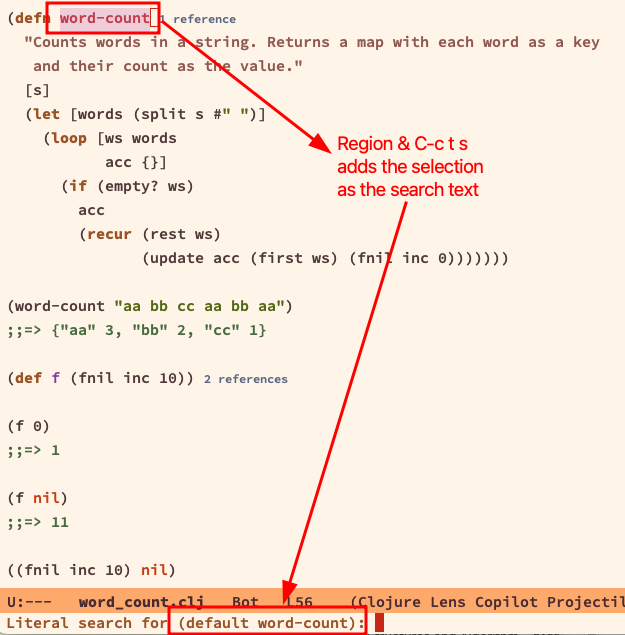

---
tags:
  - emacs
  - text-editor
  - search
description: Tips, ideas and examples on common, useful daily workflow to perform tasks when using rg.el (ripgrep) package
---
## Links and Resources

- https://github.com/dajva/rg.el
- https://rgel.readthedocs.io/en/latest/

Let's assume we re using the default `rg.el` keybindings:

```lisp
(use-package rg
  :ensure t
  :config
  (rg-enable-default-bindings))
```

## Basics

After a search is performed, maybe with `C-c s t`, it is **not** necessary for point to be in the rg results buffer to navigate the results. `M-g n` and `M-g p` will navigate the results, even if the rg results buffer is not visible (when, for example, it was hidden with `C-x 1` to focus on some other buffer exclusively).

## Search region (visual selection)

> [!INFO] What are regions?
> A visual selection of text is called a “region“ in emacs.

Mark a region of text then type `C-c s t` and the selected text should be placed as the search text by default in the minibuffer.

