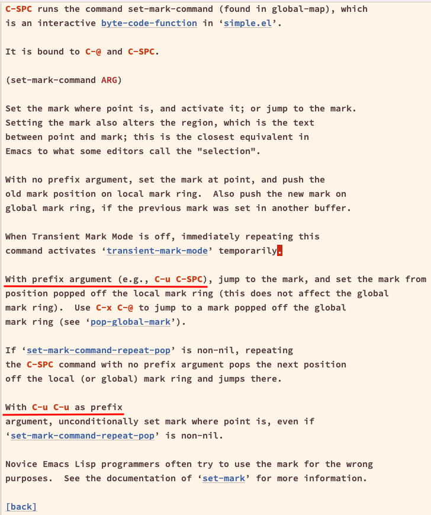

---
tags:
  - emacs
  - keybindings
description: Notes and practical examples on the most common and useful tasks while working on a programming project using Emacs.
---

## Notes from the Emacs tutorial

The Tutorial can be accessed by `C-h t` or `M-x help-with-tutorial`.

Keyboard:

- `RET` is the `Return` or `Enter` key.
- `CONTROL`, `Ctrl` or `C` is the control key.
- `META` or `M` is the `Alt` or `Opt` key.
- `C-<chr>` means “hold control and type `<chr>`“.
- `M-<chr>` means “hold alt and type `<chr>`“.

`META` can also be gotten by typing and releasing `Esc` or `Ctrl+[`.

The place in the text where the cursor is is called “point“, because that is is the point where the cursor is in the text 😉.

`C-x C-c` to close Emacs.

`C-g` to quit or cancel a partially entered command.

`C-x k RET` to kills (close) the current buffer.

`C-v` and `M-v` to move forward and back (down and up) one screen of text.

`C-l` (lowercase L, not 1 (one)) to move the line where the cursor to the center of the screen. Repeating `C-l` moves line where the cursor is to the top, then to the bottom.

`C-p` and `C-n` to move the cursor to the previous and next line.

`C-b` and `C-f` to move the cursor back and forth by one character.

`M-b` and `M-f` moves the cursor back and forth by one _word_.f

> [!NOTE] Screen edges and scrolling
> When the cursor is at the edge of the screen, most these movement keybindings will scroll the screen in some appropriate way so that the cursor and the text surrounding it is still visilbe.

> [!INFO] meta vs control
> Notice the parallel between `C-f` and `C-b` on the one hand, and `M-f` and `M-b` on the other hand.  Very often *meta* characters are used for operations related to the units defined by language (words, sentences, paragraphs), while _control_ characters operate on basic units that are independent of what you are editing (characters, lines, etc).

`C-a` and `C-e` move to the beginning and end of a line.

`M-a` and `M-e` moves to the beginning and end of a sentence.

`M-<` (meta less-than, on some keyboards, needs `Shift` to type `<`) to move to the beginning of the buffer, and `M->` (meta more-than) to move to the end of the buffer.

## Finding docs and help

### isearch-describe-key C-h k

`C-h k` followed by some keybinding, like `C-x C-s` shows the documentation of that keybinding, including to which function it is bound to.

Some commands take a prefix, like `C-u C-SPC` (`pop-mark`). But if we try `C-h k C-u C-SPC`, the help will show up right after we type `C-u` and *before* we have the chance to complete with `C-SPC`. It happens that the use of prefixes (`C-u`, `M-some-number`) is generally documented in the normal command without the prefix. So for `C-c C-SPC`, we should look for the help text of `C-SPC` without the `C-u` first. So, instead of `C-h k C-u C-SPC`, we type `C-h k C-SPC`.

Also take a look at `C-h b` and `C-h w`.

## Files and directories

## C-x C-f (find-file)

With a package like ido, help, etc., trying to `C-x C-f` to create a new file will attempt to complete similar names of files in the given directory, and open that instead of creating a new one.

- https://stackoverflow.com/questions/16615253/emacs-will-not-visit-new-file-but-insists-on-opening-a-similar-one

People recommend a few things, like typing `C-f` once again, or using `C-j` instead of `RET`. Those may or may not work depending on the packages and configs involved. Didn't work for me as I am using helm and vertico.

One option is to disable vertico-mode, `C-x C-f` to create the new file without vertico getting in the way, then enabling it again.

Another approach to do it with a shell command, either `M-x eshell` or `M-!`, and create the file with `: > newfile` or `touch > newfile`.  Both will have PWD on the directory of the current file.

Fortunatelly, vertico binds `M-RET` to `vertico-exit-input`, which is what we want:

> `vertico-exit` exits with the currently selected candidate, while `vertico-exit-input` exits with the minibuffer input instead. Exiting with the current input is needed when you want to create a new buffer or a new file with `find-file` or `switch-to-buffer`. As an alternative to pressing `M-RET`, move the selection up to the input prompt by pressing the `up` arrow key and then press `RET`.
>
> — https://github.com/minad/vertico?tab=readme-ov-file#key-bindings

On my setup `arrow up` does the same as `C-p` (previous), so I don't need to have my fingers move away from the home key.
## Go to definition

By default `M-.` is invokes `xref-find-definitions`, which is a “go to definition“. It will cause point to jump to the definition, be it in the same file or some other file (LSP may be involved to make it work depending on our emacs setup and programming language in question).

To go back to the previous jump mark, use `C-u C-SPC` (`set-mark-command`), or `C-x C-SPC` or `C-x C-@` (`pop-global-mark)` if the jump involves different files/buffers. 

Read more:

- `C-h k M-.` or `C-h f xref-find-definitions`.
- `C-h k C-SPC` or `C-h f set-mark-command`.
- `C-h k C-x C-SPC` or `C-h f pop-global-mark`.

Packages that could help jumping around:

- https://github.com/gilbertw1/better-jumper
- https://github.com/emacs-evil/goto-chg

## Built-in search capabilities

Search word under cursor, similar to Vim's `*` and `#`: Start a search with `C-s`, then `C-w` one or more times to increment the search, then `C-s` again one or more time. The search go back with `C-r`. It is also possible to start a search with `C-r` as well, and then `C-s` will “reverse” the direction of the search.

## Resources

- https://www.reddit.com/r/emacs/comments/uc25wx/navigating_an_enormous_code_base/
