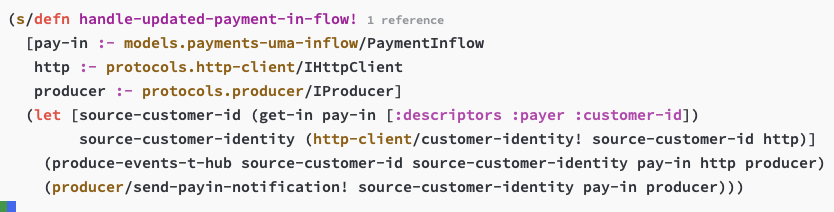
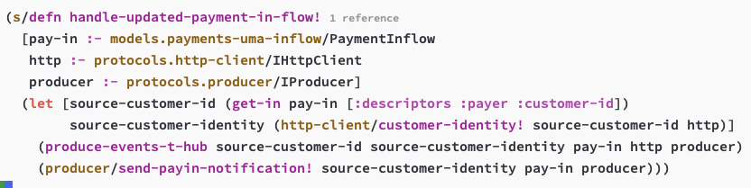

---
tags:
  - emacs
  - tree-sitter
description: Notes, tips and example configuration on using Tree Sitter with Emacs.
---
## tree-sitter-font-level

By default, the variable `tree-sitter-font-level` is set to 3. With doom-one-light theme, It gives this kind of result:

With `tree-sitter-font-level` set to 4, it improves the colors a little bit:

