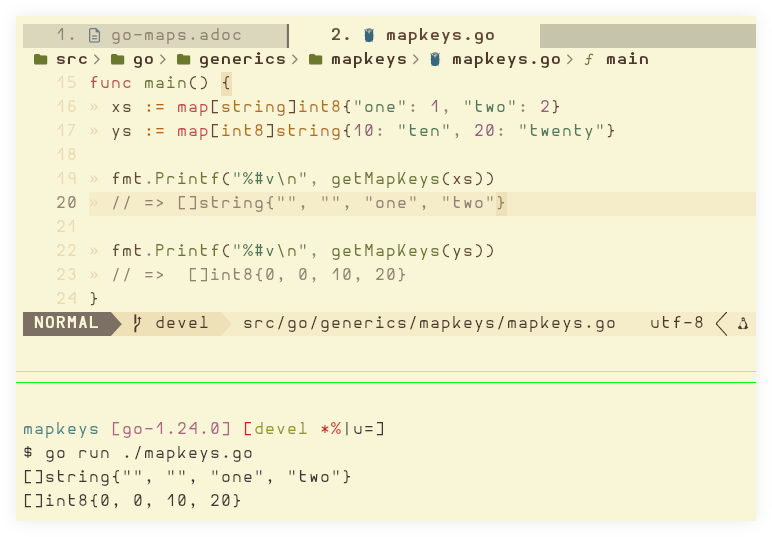
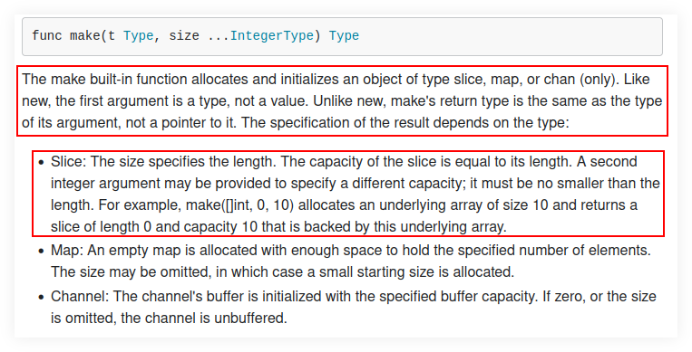

---
tags:
  - go
  - map
  - data-structure
  - dsa
description: Tips, notes, gotchas and examples about Go maps data structure.
---
## Map assignment

```go
type task struct {
  ID          uuid.UUID
  Title       string
  CreatedAt   time.Time
  CompletedAt time.Time
}

type todo struct {
  Tasks map[uuid.UUID]task
}

func New() *todo {
  return &todo{
    Tasks: make(map[uuid.UUID]task, 32),
  }
}

func (t *todo) Complete(id uuid.UUID) (task, error) {
  taskToComplete := t.FindByID(id)
  if taskToComplete.IsZero() {
    return task{},
      fmt.Errorf("could not find task with id %s", id)
  }

  t.Tasks[id].CompletedAt = time.Now()
  //~~~~~~~~~~~~~~~~~~~~~
  //~ 1. cannot assign to struct field t.Tasks[id].CompletedAt
  //~ in map [UnaddressableFieldAssign]

  return t.Tasks[id], nil
}
```


Maps in Go are hash tables that rehash and relocate entries when they grow. If `&t.Tasks[id]` were a real pointer, that pointer could be invalidated the next time anyone inserted into the map and you’d have a dangling reference to memory that now holds a different key’s value, or nothing at all. Rather than introduce some pinning mechanism or pretend the pointer is stable when it isn’t, Go just says: map elements aren’t addressable.

When we say “map elements are not addressable”, this consider this example:

```go
    p := &t.Tasks[id]
//  ~    ~~~~~~~~~~~~
//~ invalid operation: cannot take address of t.Tasks[id]
//~ (map index expression of struct type task) [UnaddressableOperand]
```

The map implementation can and will perform its internal lookup to retrieve the element at the given key, but it is not addressable.

This is a recurring theme in the Go community. A tiny bit of extra work on the developer's part makes the compiler many orders of magnitude easier to maintain and fast.

We first have to extract the item, update the field we want, and then reassign the whole item back into the map:

```go
func (t *todo) Complete(id uuid.UUID) (task, error) {
  taskToComplete := t.FindByID(id)
  if taskToComplete.IsZero() {
    return task{},
      fmt.Errorf("could not find task with id %s", id)
  }

  item := t.Tasks[id]
  item.CompletedAt = time.Now()
  t.Tasks[id] = item

  return item, nil
}
```

If map elements are not addressable, how then is it possible to do this: `t.Tasks[id] = item`? Because the map implementation will do its internal lookup to assign `item` to the key `id`. 

So in short:

- Get a reference to the map item.
- Hold on to the key.
- Update the item.
- Use the key to assign the updated item back into the map.

## Extra keys gotcha

Consider this example:

```go
package main

import "fmt"

func getMapKeys[Map ~map[Key]Val, Key comparable, Val any](coll Map) []Key {
	keys := make([]Key, len(coll))
	fmt.Println(len(coll))

	for key := range coll {
		keys = append(keys, key)
	}

	return keys
}

func main() {
	xs := map[string]int8{"one": 1, "two": 2}
	ys := map[int8]string{10: "ten", 20: "twenty"}

	fmt.Printf("%#v\n", getMapKeys(xs))
	// => #[  two one]

	fmt.Printf("%#v\n", getMapKeys(ys))
	// => [0 0 10 20]
}
```

Running the code prints:

```text
$ go run ./mapkeys.go
2
["" "" two one]
2
[0 0 20 10]
```

Why does it print `["" "" two one]` and `[0 0 20 10]`?  That is, ignoring the order of the resulting keys (which is another topic), why are we not getting `[two one]` and `[20 10]` instead?  Why are we getting the two extra empty spaces in `["" "" two one]` and the two extra zeroes in `[0 0 20 10]`?

It boils down to the fact that we are using `make([]Key, len(coll))`, and it creates a slice of length 2 because our sample inputs have length 2.  Because the slice has _length_ 2 (not just _capacity_ 2), its two elements have the zero-value keys, which is the empty string for the map with `string` keys, and 0 (zero) and for the map with `int8` keys.  Then, we _append_ while adding the keys, which enlarges the slices to make room for the keys we are appending.

So the output `[␠␠two one]` is the first empty string key followed by a space, then the second empty string key followed by another space (that makes up for the two leading spaces`), then the key "two" followed by a space, ending with the key "ten".

The output for `[0 0 20 10]` follows a similar logic.  First the initial two zero values for the original slice of `int8`.  That is 0 followed by a space, then another 0 followed by another space, ending with the two keys 20 and 10 that we append.

We could visualize `[␠␠two one]` as `["" "" two one]`, with the empty double quote strings representing the two empty string keys.  In fact, if we print with the `%#v` format specifier (instead of `%v` we used originally), we do get a better visualization of the empty strings:

```go
func main() {
	xs := map[string]int8{"one": 1, "two": 2}
	ys := map[int8]string{10: "ten", 20: "twenty"}

	fmt.Printf("%#v\n", getMapKeys(xs))
	// => []string{"", "", "one", "two"}

	fmt.Printf("%#v\n", getMapKeys(ys))
	// =>  []int8{0, 0, 10, 20}
}
```



In any case, since we just want the actual keys, the solution is to pass 0 to ``make()`’s second parameter, so the slice has length 0, and a third integer to specify the capacity, which because we want all the keys, we use the length of the original map as the capacity, but we use it in the third parameter this time. Something like this:

```go
keys := make([]Key, 0, len(coll))
```

This way, we start the slice with length zero so there will be no zero-valued keys, but make the capacity the same as `len(coll)` so we have enough room for all the keys.

With that change (which may look simple, but takes a deeper knowledge or arrays, slices + length vs capacity), our output should look like we originally expected:

```go
$ go run mapkeys.go
[one two]
[10 20]
```

For reference, as of February 2025, this is how the docs for the built-in `make()` looks like:



## Resources

* https://pkg.go.dev/builtin#make
* https://go.dev/blog/slices-intro
* https://go.dev/blog/slices
* https://pkg.go.dev/fmt
* https://quii.gitbook.io/learn-go-with-tests/go-fundamentals/maps
* https://blog.golang.org/go-maps-in-action
* https://dave.cheney.net/2017/04/30/if-a-map-isnt-a-reference-variable-what-is-it