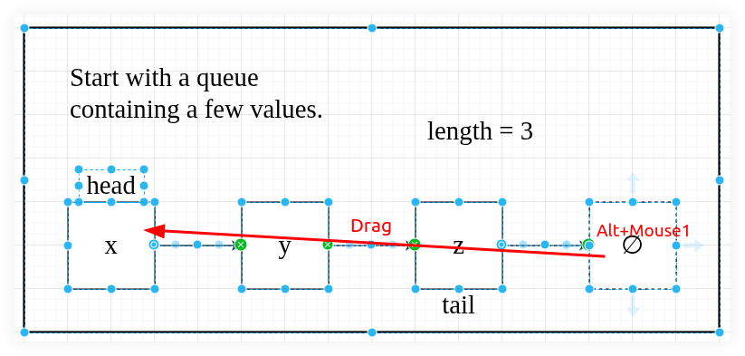

---
tags:
  - xfce
  - window-manager
  - desktop
description:
---

## Disable Alt+Mouse1 to move windows

I needed `Alt+Mouse1` to drag to select multiple elements inside DrawIO box, but it was moving the window instead. Had to open xfce4-settings-editor and remove “Alt” from the “easy_click” setting:

Then I could do this:

> [!WARNING]
> Disabling that also causes `Alt+Mouse2` to stop working, which is very useful to *resize* windows.
>
> Remember that "Shift+Mouse" and "Ctrl+Mouse" are already also used to multi-select, or select ranges of files, so replacing "Alt" with either "Shift" or "Ctrl" is probably not the best solution.
>
> Arch Linux with Xfce, I replaced "Alt" with "Super" and everything has been working fine so far and I don't miss any key+mouse feature. I now just have to use "Super+Mouse1" and "Super+Mouse2" to move and resize windows (instead of "Alt+Mouse1" and "Alt+Mouse2").

References:

- https://www.drawio.com/blog/shortcut-select-shapes
- https://forum.xfce.org/viewtopic.php?id=2989