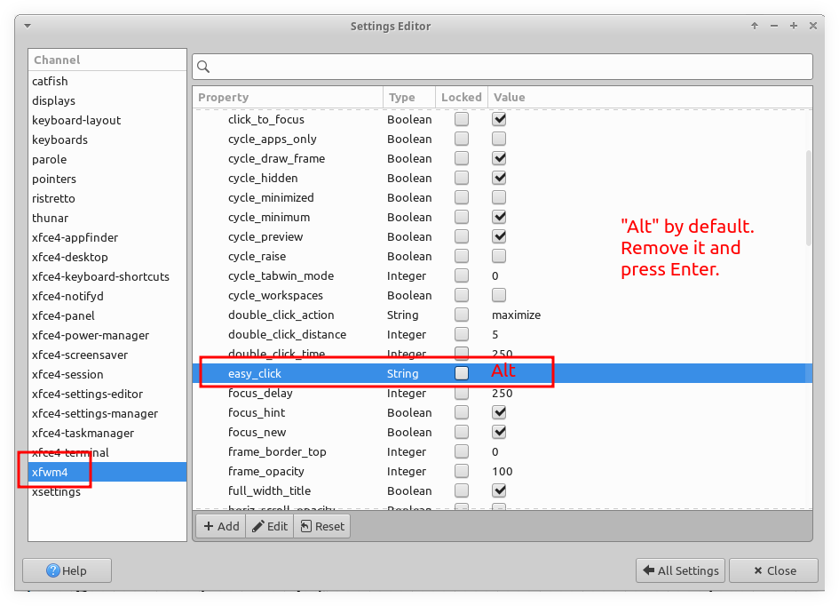

---
tags:
  - xfce
  - window-manager
  - desktop
description:
---

## Disable Alt+Mouse1 to move windows

I needed `Alt+Mouse1` to drag to select multiple elements inside DrawIO box, but it was moving the window instead. Had to open xfce4-settings-editor and remove “Alt” from the “easy_click” setting:

Then I could do this:

> [!WARNING]
> Disabling that also causes `Alt+Mouse2` to stop working, which is very useful to *resize* windows. Instead of simply removing "Alt", maybe replace it with "Shift" or "Ctrl" so it is still possible to move and resize windows with that "key+mouse" combo.

References:

- https://www.drawio.com/blog/shortcut-select-shapes
- https://forum.xfce.org/viewtopic.php?id=2989