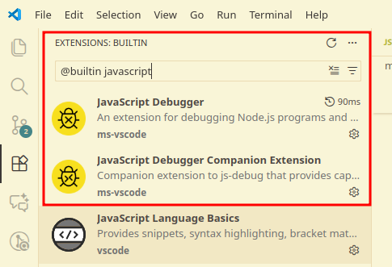
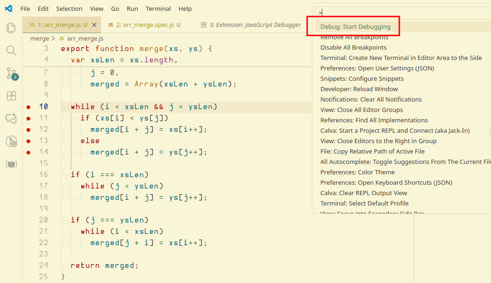
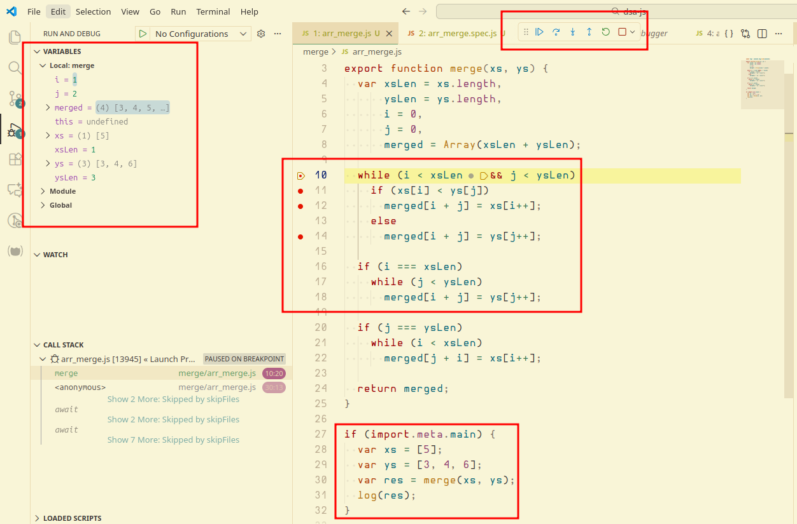

---
tags:
  - nodejs
  - debug
  - vscode
  - nvim
  - cmdline
description: How to debug Node.js programs using a few different approaches, including in the editor and from the command line.
---


## Debug Nojde.js programs from the command line and Chromium

Run the program with something like this command:

```text
$ node --inspect-brk ./my_program.js
```

It will say something about the debugger listening on localhost and some port. For example, after a debugging session I had this terminal session content:

```text
$ node --inspect-brk ./merge/arr_merge.js 
Debugger listening on ws://127.0.0.1:9229/de6f701f-3cc6-4b47-84ba-04c530b29679
For help, see: https://nodejs.org/en/docs/inspector
Debugger attached.
Debugger ending on ws://127.0.0.1:9229/de6f701f-3cc6-4b47-84ba-04c530b29679
For help, see: https://nodejs.org/en/docs/inspector
[ 3, 4, 5, 6 ]
```

Then on Chromium or Google Chrome, type “chrome://inspect” on the address bar and click “inspect”. The DevTools window shows up where it is possible to do the usual debugging tasks, like adding breakpoints, stepping, adding watchers, etc.


### References

- https://nodejs.org/api/debugger.html


## Debug Node.js programs in VS Code

Make sure these (builtin) extensions are enabled:

- JavaScript Debugger
- JavaScript Debugger Companion Extension



Then add one or more breakpoints, open the command palette and run “Debug: Start Debugging”:



Here's me debugging a merge function in vanilla JavaScript:



