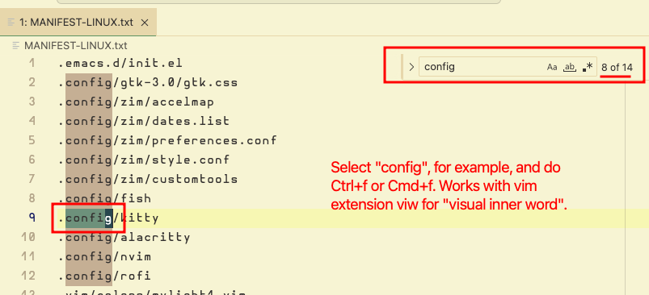

---
tags:
  - vscode
  - search
  - text-editor
description: Tips and tricks on using various approaches for searching text and symbols in VS Code.
---
## Search for text in the current file

Select some word or text, and then hit `Ctrl+f` or `Ctrl+f` to perform a search of that selection in the current file.

